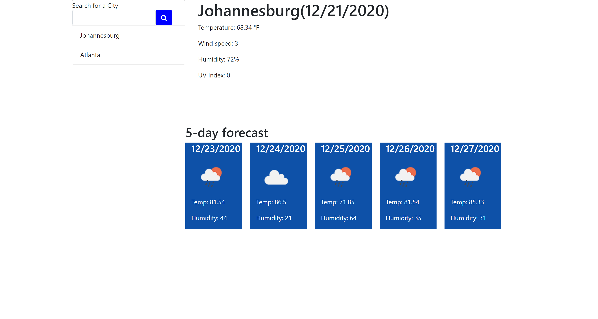

# weather-dashboard

## Description
The Weather Dashboard allows the user to enter the name of a city and receive the daily weather for that city, including the temperature, humidity, wind speed, and UV index.  In addition, the user is provided with a five-day forecast.  Upon refreshing the page, the forecast for the last searched city will appear, and a list of all searched cities is available to remind the users which cities they have looked up in the past.

To see the final result, you can view the webpage live at [weather-dashboard](https://jacquie24.github.io/weather-dashboard/).

## Usage
Upon opening the page, the user is presented with a search bar.  The user need only type in the name of a city to generate the forecast.  Here is what the page looks like once a city has been entered into the search bar. 

## Installation
To view this webpage and any others I've designed, check out my GitHub repository at [Jacquie24](https://github.com/Jacquie24?tab=repositories).  

## Credits
Although I was able to work through a large portion of this assignment on my own, the class lesson on local storage presented by Jonathan Watson [GitHub link](https://github.com/jonathanjwatson) was extremely helpful to me.

## License
This page is using the [MIT](./license.txt) license.

